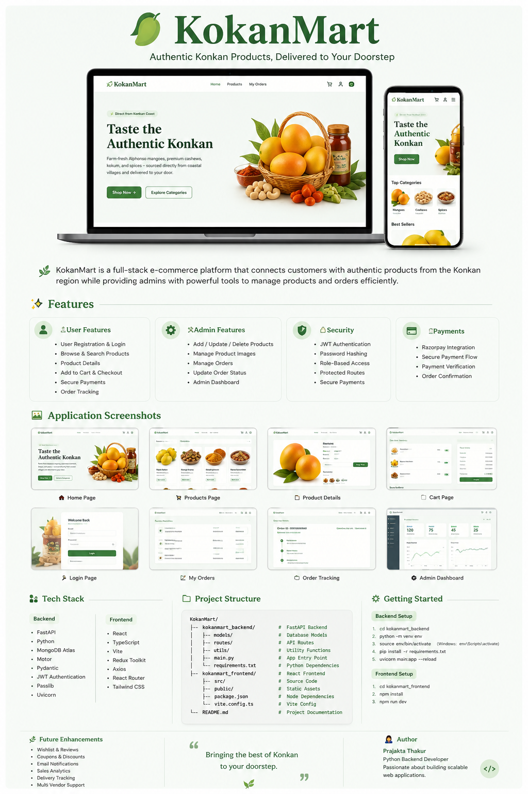

# 🥭 KokanMart - Full Stack E-Commerce Platform


<p align="center">
  
</p>

<p align="center">
A modern full-stack e-commerce platform built to connect customers with authentic Konkan products.
</p>
---

# 📖 Overview

KokanMart is a full-stack e-commerce application that enables customers to purchase authentic products from the Konkan region while providing administrators with a complete product and order management system.

The platform is built using **FastAPI**, **React**, **MongoDB**, and **JWT Authentication**, following a modular and scalable architecture.

---

# ✨ Features

## 👤 Authentication

* User Registration
* Secure Login
* JWT Authentication
* Password Hashing (bcrypt)
* Role Based Authorization
* Admin & Customer Roles

---

## 🛍 Product Management

### Admin

* Create Product
* Update Product
* Delete Product
* Upload Product Images
* Manage Inventory
* Seasonal Product Support

### Customer

* View Products
* View Product Details
* Browse Categories
* Search Products

---

## 📦 Order Management

* Create Order
* View My Orders
* Order Details
* Order Status Tracking

---

## 💳 Payments

* Razorpay Integration
* Secure Payment Flow
* Payment Verification

---

## 🔐 Security

* JWT Authentication
* Password Hashing
* Protected Routes
* Role-Based Access Control
* CORS Configuration
* Secure API Design

---

# 🏗 Project Structure

```
KokanMart
│
├── kokanmart_backend
│   ├── models
│   ├── routes
│   ├── utils
│   ├── main.py
│   ├── database.py
│   └── requirements.txt
│
├── kokanmart_frontend
│   ├── src
│   ├── public
│   ├── package.json
│   └── vite.config.ts
│
└── README.md
```

---

# ⚙ Tech Stack

## Backend

* FastAPI
* Python
* MongoDB
* Motor
* JWT
* Passlib
* Pydantic
* Uvicorn

## Frontend

* React
* TypeScript
* Vite
* Axios
* React Router

## Database

* MongoDB Atlas

## Payment Gateway

* Razorpay

---

# 🚀 Installation

## Clone Repository

```bash
git clone https://github.com/yourusername/KokanMart.git
cd KokanMart
```

---

# Backend Setup

```bash
cd kokanmart_backend

python -m venv env
```

### Windows

```bash
env\Scripts\activate
```

### Linux / Mac

```bash
source env/bin/activate
```

Install dependencies

```bash
pip install -r requirements.txt
```

Run Backend

```bash
uvicorn main:app --reload
```

Backend URL

```
http://localhost:8000
```

---

# Frontend Setup

```bash
cd kokanmart_frontend

npm install
```

Run Frontend

```bash
npm run dev
```

Frontend URL

```
http://localhost:5173
```

---

# Environment Variables

Backend `.env`

```env
MONGO_URL=your_mongodb_url

DATABASE_NAME=KokanMart

SECRET_KEY=your_secret_key

CLOUDINARY_CLOUD_NAME=

CLOUDINARY_API_KEY=

CLOUDINARY_API_SECRET=

RAZORPAY_KEY_ID=

RAZORPAY_KEY_SECRET=
```

Frontend `.env`

```env
VITE_API_URL=http://localhost:8000
```

---

# API Endpoints

## Authentication

| Method | Endpoint              |
| ------ | --------------------- |
| POST   | /auth/signup          |
| POST   | /auth/login           |
| POST   | /auth/forgot-password |
| POST   | /auth/reset-password  |

---

## Products

| Method | Endpoint                      |
| ------ | ----------------------------- |
| GET    | /products/get_all_products    |
| GET    | /products/{id}                |
| POST   | /products/create_product      |
| PUT    | /products/update_product/{id} |
| DELETE | /products/delete_product/{id} |

---

## Orders

| Method | Endpoint          |
| ------ | ----------------- |
| POST   | /orders/create    |
| GET    | /orders/my_orders |
| GET    | /orders/{id}      |

---

# Screenshots

## Home Page

---

## Login Page

*Add Screenshot*

---

## Products Page

*Add Screenshot*

---

## Admin Dashboard

*Add Screenshot*

---

# Future Enhancements

* Wishlist
* Product Reviews
* Coupons
* Email Notifications
* Sales Analytics
* Delivery Tracking
* Multi Vendor Support
* AI Product Recommendation

---

# Author

**Prajakta Thakur**

Python Backend Developer

FastAPI • MongoDB • React • JWT • AI Applications

---

# ⭐ Support

If you found this project useful, please consider giving it a ⭐ on GitHub.
